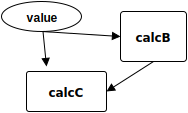
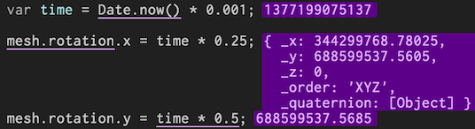
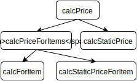
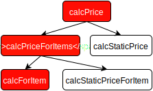

Сегодня я предлагаю обсудить тему сайд-эффектов и борьбы с ними. 
Что такое сайд-эффект? Это довольно философский вопрос. Обычно функции с сайд-эффектами противоставляют чистым функциям.

> Чистая функция это функция которая зависит только от cвоих аргументах и при одинаковых аргументах всегда возврашает одно и тоже значение.

Звучит довольно просто, однако на практике в языках без явных ограничений на чистоту функции [данное определение не так однозначно как кажется](http://staltz.com/is-your-javascript-function-actually-pure.html). Хм, похоже мы все больше углубляемся в философию - давайте попробуем разобратся с этим вопросом на практике.

#Определимся со свойствами

Давайте посмотрим на простой пример фронтенд кода:

```javascript
var URL = 'https://api.giphy.com/v1/gifs/random?api_key=dc6zaTOxFJmzC&tag=cats';

function app() {
  document.querySelector('button').addEventListener(
    'click',
    () => fetch(URL)
      .then(response => response.json().data.image_url)
      .then(gifSrc => document.querySelector('img').setAttribute('src', gifSrc))
  );
}
```
Легко можно заметить что большую часть кода здесь занимают вызовы которые влияют или зависят от внешнего окружения функции `app`. Такие вызовы обычно и называют сайд-эффектами. Их так назвали из-за свой неявности - `app` не возврашает какое то значение явно через `return` однако очевидно, что она выполняет некотрую работу с вполне конкретными результатами:
 - функция делает HTTP запрос при помощи `fetch`
 - функция устанавливает аттрибут `src` тегу `img` при помощи `.setAttribute` 

Также функция не принимает никаких аргументов, но мы можем заметить что она явно зависит от определенных значений:
 - функция зависит от событий полученных из `document.addEventListener`
 - функция зависит от результата HTTP запроса полученного из `fetch`

Чтобы лучше понять что такое сайд-эффект, давайте попробуем выделить их ключевые свойства. То что будет удовлетворять этим свойствам мы и будем считать сайд-эффектом.
Первое и самое главное:

`Сайд-эффект это не первоклассный обьект`

Что это значит? [Первоклассный объект(first-class object)](https://ru.wikipedia.org/wiki/%D0%9E%D0%B1%D1%8A%D0%B5%D0%BA%D1%82_%D0%BF%D0%B5%D1%80%D0%B2%D0%BE%D0%B3%D0%BE_%D0%BA%D0%BB%D0%B0%D1%81%D1%81%D0%B0) это сущность в языке программирования которую:
 - можно сохранить в переменной или структурах данных
 - можно передать в функцию как аргумент
 - можно вернуть из функции как результат

Проще говоря первоклассный объект можно легко представить в виде некотрого _значения_.
Очевидно что для сайдэффектов это не так. Мы не можем взять и просто переписать функцию `app` в виде:

```javascript
function app(httpResponse, domEvent) {
  ... our logic
  return { httpRequest, domMutation };
}
```


`Сайд-эффекты зависят от/влияют на внешнее окружение`

Это довольно очевидное свойство. Для того чтобы корректно выполнить некотрый сайд-эффект нам необходимо корректное окружение - для HTTP запроса нужна рабочая сеть, для запроса к DOM необходим сформированный DOM и так далее.

`Сайд-эффекты изменяют свойства кода в котором используются - до самой вершины стека вызовов`

Функция с сайд-эффектом внутри, сама становится в некотром смысле сайд-эффектом. Что такое `fetch`? Это функция которая внутри себя содержит сайд-эффекты или это целиком сайд-эффект? А если завернуть ее в дополнительную обертку? Для нас важно то что использование сайд-эффектов внутри других функций приводит к тому что эти функции приобретают все свойства сайд-эффектов.
На самом деле скорее всего это вытекает из первого свойства - но это только догадка и поэтому я решил оставить это отдельным пунктом.

#Что все это значит для нас?

Ну окей сайд-эффекты имеют свои специфичные свойства. Но всетаки в чем же отличие на практике между кодом с сайд-эффектами и без.

 - Код с сайд-эффектами сложен для анализа(как человеком так и машины)

Для начала давайте посмотрим на код без сайд-эффектов - все функции в нем чистые.

```javascript
function calcAnything(value) {
  var a = calcA(value);
  var b = calcB(value);
  return сalcC(value, b);
}
```
Мы можем легко увидеть какие значения от каких зависят и от каких совсем не зависят. К примеру мы видим что от `a` ничего не зависит и его вычисление можно смело удалить. Более того мы можем построить граф вычислений:



А теперь попробуем проделать то же самое с кодом в котором возможно содержатся сайд-эффекты:

```javascript
function doSomething() {
  var a = doSomethingA(value);
  var b = doSomethingB(value);
  return doSomethingC(value, b);
}
```

Мы все еще можем сказать что к примеру `b` зависит от `value`, но мы не можем со всей уверенностью утверждать что к примеру `b` не зависит от вычисления `a` - представьте что `doSomethingA` записывает чтото в файл из которого затем читает `doSomethingB`. Соотвественно в коде с сайд-эффектами любое вычисление потенциально может зависеть от любого - так как все они влияют на один и тот же внешний мир.

Прямым следствием из этого является то что:

- код с сайд-эффектами сложно рефакторить

Первый пример можно легко переписать в виде:

```javascript
function calcAnything(value) {
  return сalcC(value, calcB(value));
}
```

Для второго мы не можем сделать такого изза неявности связей.

 - код с сайд-эффектами сложно переиспользовать

Это более неочевидное следствие из свойств сайд-эффектов. Давай вновь взглянем на код состоящих из чистых функций:
Мы написали очень сложную функцию которая считает длину и сумму массива.

```javascript
function calcLengthAndSum() { ... }
```
Используя ее мы можем легко написать функцию вычисляющую только длину списка:

```javascript
function calcLength(list) {
  return calcLengthAndSum(list).length;
}
```

Или его среднее:

```javascript
function calcMean(list) {
  var res = calcLengthAndSum(list);
  return res.sum / res.length;
}
```

Чистые функции крайне легко переиспользуются - даже если они делают чтото лишнее или чтото чуть чуть не так, мы всегда можем исправить это просто добавив обертку из еще одной чистой функции. Как говорится: "Любую проблему можно решить введением дополнительного уровня абстракции".

Давайте посмотрим на функцию с сайд-эффектами, которая делает хттп запрос и записывает результат в некотрый файл:

```javascript
function sendRequestAndWriteFile() { ... }
```

Теперь где-то в коде нам понадобилось отправлять тот же запрос но не записывать его в файл. Хм, скорее всего мы добавим специальную опцию в `sendRequestAndWriteFile`.

```javascript
function sendRequest() {
  return sendRequestAndWriteFile({
    onlyRequest: true
  });
}
```

И то же самое для ситуации когда нам захотелось отправлять запросы на другой юрл:

```javascript
function sendRequestAndWriteFileOnUrl(url) {
  return sendRequestAndWriteFile({ url: url })
}
```

Мы не можем изменить или отменить некотрый сайд-эффект из вне места его создания. Это заставляет нас вместо простого переиспользования добавлять множество опций в функцию, что очень сильно увеличивает сложность(цикломатическая) кода.

 - сайд-эффекты сложно тестировать

С этим наверняка знакомы все. Сравните:

```javascript
it('2 + 2 = 4', () => {
  var result = add(2, 2);
  expect(result).toBe(4);
})
```

с:

```javascript
it('remoteAdd send args to endpoint', () => {
  var postCalls = [];
  var fakeRes = {};
  mock(HttpClient, {post: (...args) => {
    postCalls.push(args);
    return fakeRes;
  }})
  var result = remoteAdd(2, 2);
  expect(postCalls.length).toBe(1);
  expect(postCalls[0]).toEqual({url: URL, params: {a: 2, b: 2}});
  expect(result).toBe(fakeRes);
});
```

Для тестирования сайд-эффектов обычно необходимы [моки или стабы](http://stackoverflow.com/questions/3459287/whats-the-difference-between-a-mock-stub). Нам не важен сейчас способ, которым мок попадает в тестируемую сущность - для этого может использоватся [DI](https://angular.io/docs/ts/latest/guide/dependency-injection.html), [системы контекстов](https://facebook.github.io/react/docs/context.html), либо специальные [системы мокинга зависимостей в рантайме](https://facebook.github.io/jest/docs/api.html#jestmockmodulename-factory-options) различных тестовых фреймворков.

Однако в любом случае составить хороший мок или стаб(или проверить его) зачастую не так то просто. В первую очередь из-за неявности работы с такими объектами - они могут зависеть друг от друга неявно, либо мы просто можем забыть о каком то моке и не протестировать часть функционала. Чтобы составить хороший мок, нам необходимо просмотреть _весь_ код который исполняется при тестировании определенной сущности. И если для небольшой функции типо `remoteAdd` это не составит труда, то при тестировании всего приложения или его крупной части(некотрого подприложения к примеру) это становится почти не возможно.

Именно из-за сложностей привнесеных сайд-эффектами программисты как правило не тестируют свой код целиком, а ограничиваются только изолированным юнит-тестированием. Сайд-эффекты делают _не возможным_ любой вид интеграционного тестирования, без поднятие полноценного браузерного окружения. Но ведь целью тестирования является не проверить как работает PhantomJs или другой headless браузер. Тестирование необходимо для проверки бизнесс-логики работы программы. Однако сайд-эффекты не позволяют проверить одно без другого.

[Более подробная статья о проблемах тестирования с моками](http://rea.tech/to-kill-a-mockingtest/)

 - сайд-эффекты непредсказуемы и не воспроизводимы

Станете ли вы заворачивать вызов `add(2, 2)` в блок `try/catch`? Думаю нет - в этом нет смысла.
А `divide(a, b)`? Да конечно - при `b === 0` произойдет ошибка.

Может ли произойти ошибка при вызове `remoteAdd(2, 2)` и если да то при каких входных параметрах? Да может, при любых параметрах. А может и не произойти. Мы не знаем, и ни как не можем повлиять на это. Внешний мир непредсказуем он может сломатся в любой момент - браузер может упасть, сеть может погаснуть, а сервер сгореть.

Из-за того, что внешний мир непредсказуем и постоянно изменяется мы также не можем воспроизвести результаты вычислений содержащих сайд-эффекты.

`add(a, b) === add(a, b)` будет всегда истинно в любых условиях и окружении. Мы можем легко воспроизвести результаты некотрой проблемы с продакшена просто взяв к примеру входные данные с мониторинга и запустив вычисления с этими параметрами. Сайд-эффекты приводят к невоспроизводимым багам - чтобы понять в чем была проблема нам надо проанализировать не только наш код но и состояние всего окружающего мира в тот момент. Это намного более трудоемко, а порой и вообще не возможно.

 - сайд-эффекты не типизируются

Одним из способов контроля кодовой базы и доказеательства отсутствия нежелательного поведения программы являются статическая типизация. Очень много копьев сломано вокруг того [нужна ли она вообще](https://habrahabr.ru/post/192108/) или [нет](https://medium.com/javascript-scene/the-shocking-secret-about-static-types-514d39bf30a3#.kzfrsyeim). Мое мнение простое - статическая типизация это инструмент незаменимый для написания некотрого типа ПО - такого где очень много кода, много программистов, много связанных подсистем.

Однако вопрос не в этом, а в том как на использование типизации влияют сайд-эффекты. Расмотрим пример - предположим мы имеем функцию, которая по описанию изменения как то модифицирует DOM: 

```javascript
function patchDOM(patch: DOMPatch): void { ... }
``` 

Неявно эта функция зависит от существования DOM. И ее результатом является его изменение. Однако мы никак не можем описать эту информацию в типах - ни о неявной зависимости от DOM ни о том что ее результатом будет его изменение. В результате если мы случайно применим эту функцию в окружении без DOM, то получим ошибку при исполнении:

```javascript
function serverProgram() {
  ...
  patchDOM(patch); // run-time error
}
```

Сайд-эффекты за счет своей неявности неподдаются описанию типами и тайп-чекер не может помочь найти проблемы с ними.

Возможным решением является использование [имитации Higher-Kinded types](https://medium.com/@gcanti/higher-kinded-types-in-flow-275b657992b7#.430oe011t) для реализации [типа `Eff`](https://medium.com/@gcanti/the-eff-monad-implemented-in-flow-40803670c3eb#.521yqwoyu) при помощи `Flow`.

```javascript
type DOM = { type: 'DOM' };
function patchDOM(patch: DOMPatch): Eff<{ write: DOM }, void> { ... }
```

И соотвественно `serverProgram` просто не скомпилируется если у нее в типе не будет указан `Eff` типа `{ write: DOM }`, а внутри нее будет использоватся `patchDOM`.

Однако, такой способ полагается на не самые очевидные механизмы `Flow` и не является официально поддерживаемым.

 - усложнение интерактивной разработки кода с сайд-эффектами

Интерактивная разработка начинает набирать популярность. Практически все более-менее популярные языки имеют в стандартной поставке [REPL](https://ru.wikipedia.org/wiki/REPL)(отдельно или в составе дебаггера). Современные браузеры и вообще позволяют [писать код прямо в них](http://www.hongkiat.com/blog/google-chrome-workspace/).

Появляются и отдельные IDE нацеленные именно на интерактивную разработку. К примеру [Ligth table](http://lighttable.com), позволяющая в реальном времени следить за результатами вычислений:



[Отличная статья о том почему интерактивная разработка - это прекрасно!](http://tonsky.me/blog/interactive-development/)

Давайте посмотрим какие коррективы вносят сайд-эффекты в подобную практику. Допустим мы разрабатываем функцию осуществляющую запрос на удаление некотрого юзера - `deleteUser`. Очевидно что мы не сможем запустить эту функцию несколько раз для одного и того же юзера чтобы проверить ее работу в REPL. Более того для проверки результатов ее работы нам понадобится каждый раз смотреть текущее состояния сервера.

Главное преимущество интерактивной разработки - быстрая ответная реакция от только что написанного кода - в таком случае сводится на нет, тем что нам необходимо постоянно наблюдать состояние окружающего мира и периодически "фиксить" его - например востонавливать удаленного юзера.

Возможным решением здесь будет REPL интегрированный в тестовый фреймворк - `jest-repl`, `mocha debug repl` с встроенной возможностью устанавливать моки для определенных сайд-эффектов.

 - для кода с сайд-эффектами сложно применить тестирвание основанное на проверке свойств

Тестирование основанное на проверке свойств или генеративное тестирование или property-based тестирование - техника позволяющая описывать свойства какой то программной сущности(функции к примеру) и проверять ее при помощи генерации входных параметров.

Это очень мощная техника, которая позволяет доказать(с некотрой долей вероятности конечно) некотрые утверждения о программном коде. Она становится особенно важной в языках без сильно статической системы типов. 

Но как я отметил в своей статье крайне сложно определить какое либо свойство для кода с сайд-эффектами - за счет их непредсказуемости.

Вот такие следствия несут нам сайд-эффекты в нашем коде. Но почему это все действительно важно? Ну да что-то стало сложнее сделать - но программисты привыкли борьбе со сложностью. И в отдельных пунктах я приводил результаты такой борьбы - инструменты которые призваны хоть как то уменьшить негативное влияние сайд-эффектов.

Проблема в том что сайд-эффекты не только усложняют написание и работу с самим кодом, но и "ломают" два _базовых_ способа разработки ПО. И это уже реальная проблема.

# Два ~сломанных~ способа разработки ПО

На самом _высоком_ уровне по большому счету существует только [два способа _разработки_](https://en.wikipedia.org/wiki/Top-down_and_bottom-up_design)(не только ПО).

Давайте расмотрим на простом примере оба способа. Предположим что нам надо разработать систему `printSum`, которая будет выводить на экран сумму какого то списка.

1. "Сверху-вниз" a.k.a "Нисходящий стиль"(Top-Down)
 - Определяем спецификацию самого верхнего уровня API - описываем входное и выходное воздействие 

```javascript
printSum(list: Array): PrintedSum
```
 - Затем определяем спецификации API уровнем ниже которая необходима чтобы из `Array` получить `PrintedSum`. Очевидно что нам необходимы две функции.

```javascript
sum(list: Array): number
printToScreen(value: number): PrintedToScreenEffect
```

Теперь просто глядя на спецификации мы понимаем что сначала необходимо вызывать от `list` функцию `sum`, а затем от ее результата `printToScreen`.

Теперь осталось придумать как записывать подобные спецификации для описания входных и выходных данных, в идеале она должна:
 - описывать все возможные входные воздействия и результаты и довольно точно - тесты подходят не очень хорошо так как они описывают отдельные кейсы
 - мы должны иметь возможность проверить что разработанная нами программа соответствует изначальной спецификации - диаграммы и прочие способы связанные с ИЗО не дадут нам такой возможности

 Вы наверно уже догадались что лучше все здесь [подойдет хорошая система типов](https://robots.thoughtbot.com/thinking-in-types). Однако как мы выяснили без определенных уловок, большая часть систем типов не способны работать с сайд-эффектами и уж точно не могут вывести типы таких эффектов из контекста. Таким образом сайд-эффекты ломают первый базовый способ разработки ПО. Но может со вторым нам повезет больше?

2. "Снизу-вверх" a.k.a "Восходящий стиль"(Bottom-Up)

Мы можем пойти с другой стороны:
 - Уже по описанию задачи видно что нам надо будет уметь выводить чтото на экран и надо уметь складывать. Мы не будем пытаться определить точные спецификации. Вместо этого просто напишем общие и минимально необходимые функции для этого. Больше все эти функции будут похожи на отдельные небольшие библиотеки - очень малоспецифичные и очень переиспользуемые единицы - так как мы еще не знаем что за API нам придется с их помощью строить.
 ```javascript
sum(1, 2, 3, 4)
// -> 10
print('Hello', screen)
// -> prints 'Hello' to screen
```

 - Затем строим из этих функций API более высокого уровня.
```javascript
function printSum(list)
  print(sum(...list), screen)
}
```

Для такого итеративного процесса нам необходим инструмент:
 - позволяющий легко экспериментировать с небольшими кусочками кода и иметь возможность быстро запустить отдельные функции на разных входных данных
 - при этом в процессе разработки, нам не так важно зафиксировать некотрый результат и уметь его воспроизводить - скорее всего мы редко будем менять имплементацию уже написанного API. Тесты тут будут скорее мешать низкой скоростью ответной реакции, и своей хрупкостью

Лучше всего для такого стиля разработки подойдет REPL. Собственно такой вид разработки и получил распространие в языках с богатой практикой использования REPL - Lisp, SmallTalk итд.

Однако как мы помним REPL теряет свое главное приемущество(быстрый отклик), при разработке кода с сайд-эффектами.

Многие могут заметить, что и типизацию и REPL можно заменить комбинацией автоматическими тестами, хотя конечно результат получится намного хуже. Но и тесты писать как мы выяснили не так то просто для кода с сайд-эффектами.

Сайд-эффекты как гремлины ломают все доступные программисту инструменты до которых доберутся: типизация, тесты, интерактивные среды, статические анализаторы в IDE.

Но ведь не весь наш код содержит сайд-эффекты? И все эти неприятности касаются только тех участков в которых мы их используем? Можно ведь просто старатся использовать поменьше "грязных" функций и побольше "чистых"? К сожалению нет - давайте разберемся почему.

### Лед-9 для программного кода


> - Ты читал "Колыбель для кошки"?
> - Нет
> - Итак, этом романе мир погибает потому, что во льду обнаружена молекула, которая, при соприкосновении с водой, превращает ее в лед. А поскольку все воды мира связаны - пруд с ручьем, ручей с рекой, река с озером, озеро с океаном - таким образом весь мир замерзает и погибает. И эта молекула называется "Лед-9"

Программисты заставшие JS без Promise и async-await могут почувствовать что-то знакомое в описании недостатков сайд-эффектов. Эти же проблемы зачастую упоминались в обсуждении асинхронных функций основанных на коллбэках.

>В дальнейшем мы увидим, что на самом деле асинхронность и сайд-эффекты это довольно связанные проблемы - решив только одну из них вы не избавитесь от всех их недостатков. И наоброт - хорошее решение одной из них может помочь решить другую.

Самое ужасное в таких функциях было то что они заражали весь код в котором они использовались. Обычная функция при использования в ней функции с коллбэком переставала возвращать результат через return и начинала прокидывать его в коллбэк - и в свою очередь сама становилась "ядом" для использующего ее кода.

Появилась даже метафора двух-цветного языка:
 - [Статья Bob Nystrom](http://journal.stuffwithstuff.com/2015/02/01/what-color-is-your-function/)
 - [Доклад Андрея Саломатина](https://www.youtube.com/watch?v=OGSppLmGchY)

```javascript
blue•function doSomethingAzure() {
  // This is a blue function...
}
red•function doSomethingCarnelian() {
  // This is a red function...
}

blue•function doSomethingAzure() {
  doSomethingCarnelian()•red;  // Error - you cant call red inside blue
}
```

Все функции в языке делятся на "красные" и "синие". И чтобы вызвать "красную" функцию в "синей" нам необходимо перекрасить "синюю" функцию в красный цвет.

То же самое происходит с сайд-эффектами.

> Функция с сайд-эффектом внутри, сама становится сайд-эффектом. Следовательно используя такую функцию внутри другой(чистой) мы автоматически преврашаем ее в грязную - она начинает возвращать часть результата неявно. И так далее до самой вершины стека вызовов.

Расмотрим пример. Допустим у нас есть такая иерархия вызовов:



Все вызовы чистые и предсказуемые. С ними нет никаких проблем.

Но неожиданно нам понадобилось кешировать результаты вычисления функции `calcForItem` в `localStorage`:

```javascript
function calcForItem(...) {
  ...
  var cachedResult = localStorage
    .getItem(argsHash);
  if (cachedResult) {
    return cachedResult;
  } else {
    ...
    localStorage.setItem(argsHash, res)
    return res;
  }
}
```

И наша иерархия станет выглядеть так(красным отмечены функции с сайд-эффектами):



Изменив код всего _одной_ функции - мы изменили свойства(в плане тестируемости, надежности, композируемости) для _всего_ стека вызовов. В некотром смысле мы теряем контроль над своим кодом. Мы не можем гарантировать что никакие свойства для своего кода - так как API на котором основан наш код может _внезапно_ изменить свойства и "заразить" наш код.

# В советской России сайд-эффекты контролируют тебя!

Если мы не контролируем ПО - то оно начинает контролировать нас(разработчиков):

 - Разработчики редко пишут интеграционные(больше одного юнита) тесты - потому что это дорого и долго. Пока разберешься какое должно быть окружение в каждом конкретном тесте у тебя уже сгорел дедлайн.

 - Разработчики часто не используют типизацию - потому что очень большую часть фронтенд кода занимают функции типа `handleClick(): void`, `dispatch(): void`, `setState(): void`.

 - Разработчики не используют property-based тесты - у большей части их кода просто нет каких либо предсказуемых свойств

 - Разработчики не используют интерактивные среды(REPL) - потому что там нельзя работать с DOM элементами или безопасно послать HTTP-запрос.

 - Разработчики очень аккуратно подходят к вопросам масштабных рефакторингов - никогда нельзя гарантировать, что от какого то вызова не зависит что-либо неявно

 - Разработчики даже не пытаются делать инструментов для анализа и визуализации логики своего приложения - это попросту невозможно

 - Разработчики не имеют надежных инструментов точного воспроизведения поведения приложения - обычно не проблема по результатам мониторинга понять _что_ произошо. Но вот _почему_ так произошло может быть совершенно не ясно - так как части приложения влияют друг на друга неявно.

 - Разработчики зачастую стремятся не переиспользовать крупные части своего приложения(не говоря уже о больших и сложных сторонних компонентах) - так как неясно что они в итоге делают и сможем ли избавится от некотрых действий если они нам вдруг станут не нужны

Софт который контролирует людей? Я знаю кому это точно понравится:


Можем ли мы как то исправить ситуацию? Очевидно что для этого нам необходимо _полностью_ отделить логику нашего приложения от сайд-эффектов. Все наше приложение должно быть полностью чистой функцией: явно принимать все входящие воздействия и явно возвращать выходные. А сайд-эффекты должны исполнятся гдето отдельно от основного приложения.

Но для того чтобы реализовать подобное нам понадобятся не ультра-современные фреймворки, а теоритические основы Computer Science разработанные около 40 лет назад.


