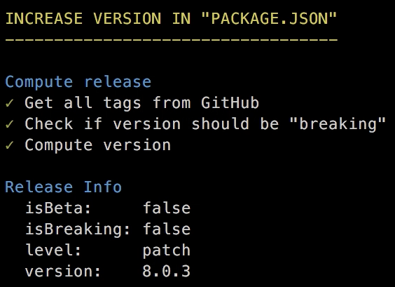

# Какие наши цели?
что есть цель работы программиста?
Что есть доказательство его работы?
---
# Единственный источник истины
Единственный полный источние истины это код
---
# Но истина мимолетна
Внешний мир очень изменчив и постоянно развивается - развиваются и требования к коду
следовательно код постоянно изменяется и развивается - это не застывший гранит

Очевидно что любые перемены всегда несут некотрую опастность - а что если мы изменим наш код не верно? Что делать - как поступать с изменениями
---
# Не борьба, а наблюдение
Лучшая тактика не пытатся избежать изменений а сделать их явными и наблюдаемыми
примеры - иммтабл и фрп
---
# Все неявное станет явным
Поможет ли нам VCS?
Изменение(Change) - происходит от "мена", "обмен"("exchange")

То есть мы обмениваем изменение кода на изменение чего то другого - чего?
---
# Что такое хорошо и что такое плохо?

Поведение:
 - желательное
 - нежелательное

Его доказательства:
 - доказательства отсуствия некотрого нежелательного поведения - свойство безопастности системы(safety)
 - доказательства наличия некотрого желательного поведения - свойство живости системы(liveness)
---
# Программа работает верно
Тесты способ доказать желательное поведение

Однако только для отдельных кейсов
Сколько тестов достаточно чтобы доказать корректность?
---
# Но это не точно...

Тестирования не достаточно
Программа - это функция
Тест - это проверка функции в конкретной точке
Множество точек на которых определена программа обычно **близко к бесконечному**
---
# Математики vs программисты

Сравниваем подходы к проблемы математиков и программистов
---
# Пусть хотя бы ничего не ломает
Окей даваайте тогда еще начнем отсекать нежелательное поведение
например

---
# Есть два способа...
Сложный -  статически при помощи Coq/Agda/TLA+/Lean Prover
Простой проверить это свойство на очень многих случайных точках
давайте проверим свойство суммы что сумма двух положительных чисел положительна
---
# Генератор

сначала сгенерим случайный числа
---
# Свойство
затем напишем функцию которая принимает свойство и генераторы и оборачивает его в функцию которая проверяет свойство один раз
---
# Checker
затем напишем функцию которая принимает свойство которое вернула предыдущая функция и выполняет его много раз
---
# В тест!
Проверяем и сводим все вместе
---
# Property-based testing

Шаги:
 - описываем свойство
 - генерим много различных вариантов аргументов
 - проверяем что на всех аргументах свойство соблюдается

Библиотеки:
 - testcheck.js (порт clojure core.check)
 - jsverify
---
# Перерыв 1
---
# Вернемся к реальной жизни
типичная ситуация - получили данные с бекенда конвертнули в вид удобный для представления а затем конвертнули обратно - в вид необходимый для апи
---
# Как создать семью?
описываю как создаются генераторы и что их можно комбайнить
генераторы похожи на описание propTypes
---
# Запрет на многоженство - динамические ограничения
динамические ограничения которые не укладываются в рамки готовых генератов делаем при помощи smap - отображаем генерируемые элементы при помощи некой функции
---
# Умолчания
Вот же засада - оказывается наши функции не обладают нужным свойством
функция convertFrom, помимо преобразований из одной структуры в другую, также проставляет некоторые значения по умолчанию (для dependant это false), то есть она не оставляет исходные значения.
мы можем ослабить свойство и проверять не на точное равенство, а на то, что структура не изменяется

---
# Изменим проверку
давайте используем для этого библиотеку рантайпс
альтернативы - ткомб, ио-тс итд можно даже проп-тайпс
согласитесь описание структуры очень похоже на описание генератора?
может мы можем получить одно из другого
---
# Легким движением руки валидатор преврашается...В генератор!
да можем - показываю как генерится генератор из валидатора
говорю что при помощи такого подхода можно проверять свойства просто описывая аргументы функций и компонентов - то есть можно например проверить prop-types на CI
---
# ПЕрерыв 2
---
# Что-то это все напоминает...
```typescript
type Family = {
  type: 'espoused' | 'single' | 'common_law_marriage' | undefined | null,
  members: Array<{
    role: 'sibling' | 'child' | 'parent' | 'spouse',
    fio: {
      firstname: string | undefined | null,
      lastname: string | undefined | null
      middlename: string | undefined | null
    },
    dependant: boolean | undefined | null
  }>
}
```
```typescript
function convertFrom(structFromBackend: Family): ConvertedFamily {}
function convertTo(structForFrontend: ConvertedFamily): Family {}
```
---
# Лирическое отступление: что такое статические типы
Аннотации типов не просто *часть* языка - это *отдельный* язык.

Может быть тьюринг полным:
 - TypeScript: https://github.com/Microsoft/TypeScript/issues/14833
 - Java: https://arxiv.org/pdf/1605.05274.pdf

Используя статическую типизацию, мы пишем код на двух языках: один что-то делает, а другой следит чтоб первый не делал что-то лишнее.

Программирование с использованием вычислений на уровне системы типов называется `typelevel` программированием.
---
# Пример: натуральные числа
```typescript
interface Nat {
  prev?: any
  isZero: 'true' | 'false'
}

interface Positive {
  prev: Positive | _0
  isZero: 'false'
}

type Succ<N extends Positive | _0> = { prev: N; isZero: 'false' }

type _0 = { isZero: 'true' }
type _1 = Succ<_0>
type _2 = Succ<_1>
```

Note: данный "прием" называется [числа Черча](http://compsciclub.ru/media/slides/systemsoftypedlambdacalculi_2011_spring/2011_02_27_systemsoftypedlambdacalculi_20_CbAymeF.pdf)
---
# Пример: список ограниченной длины

```typescript
function create<A>(as: [A, A]): Vector<_2, A>
function create<A>(as: [A]): Vector<_1, A>
function create<N extends Nat, A>(as: Array<A>): Vector<N, A> {
  return new Vector<N, A>(as)
}

class Vector<N extends Nat, A> {
  static create = create
  readonly _N: N
  readonly _A: A
  constructor(public value: Array<A>) {}
  append<N2 extends Nat>(vector: Vector<N2, A>): Vector<Add<N, N2>, A> {
    return new Vector<Add<N, N2>, A>(this.value.concat(vector.value))
  }
  zip<B>(vector: Vector<N, B>): Vector<N, [A, B]> {
    return new Vector<N, [A, B]>(
      this.value.map((a, i) => [a, vector.value[i]] as [A, B])
    )
  }
}
// v1 :: Vector<_1, number>
const v1 = Vector.create([1])
// v2 :: Vector<_2, number>
const v2 = Vector.create([2, 3])
// v2.zip(v1) // error
console.log(v2.zip(v1.append(v1))) // Vector([[2,1],[3,1]])
```

Link: https://github.com/gcanti/typelevel-ts
---
# Но есть небольшая проблема...

```typescript
[ts]
Argument of type 'Vector<Succ<Succ<_0>>, number>' is not assignable to parameter of type 'Vector<Succ<Succ<Succ<_0>>>, number>'.
  Type 'Succ<Succ<_0>>' is not assignable to type 'Succ<Succ<Succ<_0>>>'.
    Types of property 'prev' are incompatible.
      Type 'Succ<_0>' is not assignable to type 'Succ<Succ<_0>>'.
        Types of property 'prev' are incompatible.
          Type '_0' is not assignable to type 'Succ<_0>'.
            Property 'prev' is missing in type '_0'.
const v2: Vector<{
    prev: Succ;
    isZero: "false";
}, number>
```

Программировать на аннотациях типов это примерно как программировать на регэкпспах.
---
# Альтернатива?

`Dependant` типы встроенные в компилятор: `Coq`, `Agda`, `Idris`

*Типы ограниченные до значений*

```typescript
function add<A extends Nat, B extends Nat>(a: A, b: B): Add<A, B> {
  return a + b;
}
```

TEOREM PROVING IN DA HOUSE!

`Refinement`(`Liquid`) типы встроенные в компилятор:

```typescript
type nat = {v: number | 0 ≤ v}
```

Но пока не существуют в природе за рамками исследовательских проектов:
 - <a target="_blank" href="https://arxiv.org/pdf/1604.02480v1.pdf">Refinement Types for TypeScript</a>
 - <a target="_blank" href="https://www.youtube.com/watch?v=5lWIG3XQ2-A">LiquidHaskell</a>
---
# Статика против динамики
```javascript
function mean(list){
  return divide(sum(list), length(list))
}
```
.center-text[
Доказательство что эта функция для любого списка чисел вернет число.
]

.left-column-50[
В статике:
```typescript
sum(list: number[]): number
length(list: number): number
div(a: number, b: number): number
mean(list: number[]): number
```

Доказательство *по построению*

a.k.a
из внеш
Верификация(от *verus* - верный)

**Построение программы гарантирует некотрое свойство**
]
.right-column-50[
В динамике:
```javascript
jsc.forall(
  [jsc.array(jsc.number)],
  list => isNumber(mean(list))
)
```
Доказательство *по результатам*

a.k.a

Валидация(от *value* - польза)

**Результат выполнения программы обладает некотрым свойством**
]
---
# Proof Cube
.center-text[
  
]
---
# Пример
.center-text[
  
]
---
# Стеклянная стена между мирами
.left-column-50[
Статические(*по построению*):
 - опираются на структуру программы и ее исходный код
 - дают 100% гарантию
 - не требуют запуска программы и получения ее результатов
 - требуют полностью верного и согласованного построения всех промежуточных частей
]
.right-column-50[
Динамические(*по результатам*):
 - опираются только на результат работы программы
 - дают только вероятностные гарантии
 - не требуют доступа к исходному коду программы
 - не важно как построена программа - важен только вход и выход
]

.center-text[
  
]
---
# Вспомним пример
```typescript
const FamilyStruct = Record({
  type: Union(L('espoused'), L('single'), L('common_law_marriage'), Void),
  members: Array(
    Record({
      role: Union(L('sibling'), L('child'), L('parent'), L('spouse')),
      fio: Record({
        firstname: String.Or(Void),
        lastname: String.Or(Void),
        middlename: String.Or(Void)
      }),
      dependant: Boolean.Or(Void)
    })
  )
})
type Family = {
  type: 'espoused' | 'single' | 'common_law_marriage' | undefined | null,
  members: Array<{
    role: 'sibling' | 'child' | 'parent' | 'spouse',
    fio: {
      firstname: string | undefined | null,
      lastname: string | undefined | null
      middlename: string | undefined | null
    },
    dependant: boolean | undefined | null
  }>
}
```
---
# Разбиваем стену
```typescript
import { Static } from 'runtypes'

type Family = Static<typeof FamilyStruct>
```

Из одного описания данных(спецификации) можно получить:
 - динамический валидатор для данных из внешнего(нетипизированного) мира и сложных проверок не выразимых статически
 - генератор данных для проперти тестов
 - статический тип для проверки тайпчекером на этапе компиляции

Динамическое доказательство vs статическое - теперь это просто вопрос тактики:
.left-column-50[
**Статическое доказательство**

*Внутренняя структура кода устойчива и не будет переписана в ближайшее время?*
]
.right-column-50[
**Динамическое доказательство**

*Код скорее всего будет вскоре много раз переписан(стадия прототипа)?*
]
---
# Пример(все совпадения случайны!)
Задача: новый модуль для вычисления среднего списка чисел

TypeScript, --allowJs
```javascript
function meanFn(list){
  return divide(sum(list), length(list))
}
```
---
# Шаг 1. Прототип
Модуль экспериментален и возможны бизнесс-правки/рефакторинги

Стадия *активной разработки*

`mean.js`
```typescript
import { Contract, Array, Number } from 'runtypes';

const meanConstraint = ([list], result) =>
    result >= min(list) && result <= max(list)
export const MeanSpec = Contract(Array(Number), Number)
  .withConstraint(meanConstraint);
export const mean = Mean.enforce(meanFn)
```
`mean.test.js`
```typescript
import { makeJsverifyArbitrary } from 'runtypes-generate';
import { MeanSpec, mean } from './mean';
jsc.assert(jsc.forall(
  [makeJsverifyArbitrary(MeanSpec.reflect.argsTypes)],
  list => mean(list)
))
```
---
# Шаг 2. Стабильная структура
Внутреняя структура модуля стабилизировалась

Стадия *поддержки*

`mean.js` -> `mean.ts`
```typescript
function sum(list: number[]): number
function length(list: number): number
function div(a: number, b: number): number
```

В случае резкого изменения требований - к примеру надо считать не среднее, а медиану:

`mean.ts` -> `mean.js` и возвращаемся на шаг 1 практически *без потерь*

**Что еще можно полезного придумать?**
---
# Генерация тестов из рантайма
`mean.js`

```javascript
export const mean = trace('module/mean', meanFn)
```

При завершении приложения или по специальному сигналу:
```javascript
import { mean } from './mean.js'
import convert from 'call-to-jasmine-test'

mean.calls // массив вызовов за время работы приложения
convert(mean.calls) // код тест кейсов jasmine
/*
  it(1, () => expect(mean([1, 2, 3])).toEqual(2))
  ...
*/
```
---
# Генерация типов из рантайма

```javascript
import { mean } from './mean.js';
import infer from 'runtypes-infer'

mean.calls // массив вызовов за время работы приложения
infer(mean.calls) // описание типов для runtypes
/*.center-text[

]
    </textarea>
    <script src="https://gnab.github.io/remark/downloads/remark-latest.min.js" type="text/javascript">
    </script>
    <script type="text/javascript">
      var slideshow = remark.create();
    </script>
  </body>
</html>
  Contract(Array(Number), Number)
*/
```
[Automatic annotations](http://frenchy64.github.io/2016/08/07/automatic-annotations.html)

Только для clojure :(
---
# Идеальный bottom-up pipeline

1) Написали код(прототип)
```javascript
function mean(list){
    return divide(sum(list), length(list))
}
```
2) Протестировали немного руками - получили список вызовов
```javascript
[[1, 2, 3], 2], ...
```
3) Получили тесты из вызовов в рантайме - при необходимости дополнили/поправили
```javascript
describe(() => it(() => expect(mean([1, 2, 3])).toEqual(2)))
```
---
# Идеальный bottom-up pipeline
4) Сгенерировали по ним спецификации типов
```javascript
const MeanSpec = Contract(Array(Number), Number)
```
5) По ним прогнали сгенеренные тесты - узнали о краевых случаях
```javascript
jsc.assert(jsc.forall(
  [makeJsverifyArbitrary(MeanSpec.reflect.argsTypes)],
  list => mean(list)
))
```
6) Когда код стал стабильным - переключаемся на статический режим и добавляем недостающие статические типы

`mean.js` -> `mean.ts`
```typescript
function sum(list: number[]): number
function length(list: number): number
function div(a: number, b: number): number
```
---
# Автоматическое доказательство корректности версионирования
**Semantic Versioning**


Also: [ComVer](https://github.com/staltz/comver)
---
# Автоматическое доказательство корректности версионирования
Как доказать что изменение обратно-совместимо?
.left-column-50[
**Динамически:**
[Cracks](https://github.com/semantic-release/cracks)

Прогон тестов предыдущей версии на новой

]
.right-column-50[
**Статически:**
[Elm-package](https://github.com/elm-lang/elm-package)

Сопоставление сигнатур функций предыдущей и новой версии

]
---
# Проблемы?
`mean.ts`

У нас были тесты:
```javascript
it(() => expect(mean([1, 2, 3])).toBe(2))
it(() => expect(mean([])).toBe(0))
```

Типы:
```typescript
function mean(list: number[]): number
```

Но изменение пройдет незамеченным:
```diff
function mean(list) {
- return meanFn(list)
+ return medianFn(list)
}
```
---
# Решение - синтез подходов
1) У нас есть описание типа:
```javascript
const MeanSpec = Contract(Array(Number), Number)
```
2) Проверяем что для любых входных значений результат не изменился
```javascript
import { mean as prevMean, MeanSpec as prevSpec } from 'project-prev/mean';
import { mean as currMean, MeanSpec as currSpec } from 'project-curr/mean';

// сами спецификации не изменились("статический" подход)
assert(isEqualSpec(prevSpec, currSpec))

jsc.assert(
  jsc.forall(
    [makeJsverifyArbitrary(prevSpec.reflect.argsTypes)]
    // результаты работы тоже не изменились("динамический" подход)
    list => prevMean(list) === currMean(list) 
  )
)
```
3) PROFIT!
---
# Refinement типы

.left-column-50[
**Динамический**:
```typescript
Number.withConstraint(v => 0 >= v)
```

*Как сгенерировать данные такого типа?*

[Интересный пейпер с возможным решением](https://arxiv.org/pdf/1607.05443.pdf)
]
.right-column-50[
**Статический**:
```typescript
{v: number | 0 ≤ v}
```

*Как проверить это статически?*

[Refinement Types for TypeScript](https://arxiv.org/pdf/1604.02480v1.pdf)
]
---
# Решения?
.center-text[

]

1) [SMT (satisfiability modulo theories)  solving](https://ru.wikipedia.org/wiki/%D0%97%D0%B0%D0%B4%D0%B0%D1%87%D0%B0_%D0%B2%D1%8B%D0%BF%D0%BE%D0%BB%D0%BD%D0%B8%D0%BC%D0%BE%D1%81%D1%82%D0%B8_%D1%84%D0%BE%D1%80%D0%BC%D1%83%D0%BB_%D0%B2_%D1%82%D0%B5%D0%BE%D1%80%D0%B8%D1%8F%D1%85)

2) Переход к `Dependant` типам

Более общие но более неудобные для использования программистом
.left-column-50[
**Динамический**:
```typescript
Min(Number, 0)
```
]
.right-column-50[
**Статический**:
```typescript
Min<Number, _0>
```
]
---
# ~~Type~~ Spec Driven Development


А теперь попробуем Top-Down подход
---
# А что мы хотим получить?
Общая спецификация:
```typescript
type App = {
  {
    fio: {
      firstname?: string,
      lastname?: string 
    } | !isEmpty v.lastname || !isEmpty v.firstname,
    balance: PositiveNumber
  }: {
    fio: FioString,
    amount: AmountString
  };
  any: HtmlError
}
```
Кейсы:
```javascript
expect(app({
  fio: { lastname: 'Иванов', firstname: 'Иван' }
  balance: 1000000
})).toEqual({
  fio: 'Иван Иванов',
  amount: '1000000 Р'
})
...
```
---
# Как найти то - не знаю что
[Hoogle for Haskell](https://wiki.haskell.org/Hoogle)


[Rambo for Ramda](https://github.com/bahmutov/rambo)
```javascript
const solve = require('rambo').solve
const solution = solve([1, 2, 3, 4], [5, 6, 7, 8])
console.log(solution.name) // "R.map(R.add(4))"
```
---
# Не файлы а БД
TODO

---
# Синтез подходов
1) Разбиваем отображения типов на мельчайшие части каким то образом
TODO возможно уточняем типы по тестам
```typescript
{
  firstname?: string,
  lastname?: string 
} | !isEmpty v.lastname || !isEmpty v.firstname -> FioString
PositiveNumber -> AmountString
...
```
2) Ищем по соответсвиям спецификациям по проекту и подключенным либам
```typescript
formatFio({ firstname?: string, lastname?: string }): FioString
formatAmountRub(x: number): AmountString
```
3) Собираем возможную реализацию

4) Проверяем по кейсам - если не ок, то на шаг 1

5) Прикручиваем machine learning

6) ???

7) PROFIT
---
# Тайные мечты менеджеров
.center-text[

]
---
# План увольнения большинства программистов
> *В правильно заданном вопросе содержится половина ответа*

1) Динамические доказательства

- доработка `runtypes-generate`, `io-ts-generate`
- генерация данных по предикату(Refinement типы)

2) Статические доказательства

- Refinement в мейнстриме(TypeScript)
- Соотношение [Refinement, Dependant типов и логики Хоара](https://cs.stackexchange.com/questions/54957/difference-between-dependent-type-refinement-type-and-hoare-logic)

---
# План увольнения большинства программистов
3) Доламываем стену между динамическими и статическими свойствами:

 - [runtypes](https://github.com/pelotom/runtypes), [io-ts](https://github.com/gcanti/io-ts)
 - [Variadic kinds for TypeScript](https://github.com/Microsoft/TypeScript/issues/5453)

5) Bottom-Up
 - трейсинг вызовов сущностей(например для React компонентов)
 - генерация тестов по трейсингу
 - вывод типов по трейсингу

6) Top-Down
 - уход от кода в файлах - переход к коду в базе данных
 - поиск по спецификациям по проекту(БД) или NPM с валидацией по тестам - аналог Hoogle для TypeScript
 - AI
---
# Истина не познается, а сделывается
